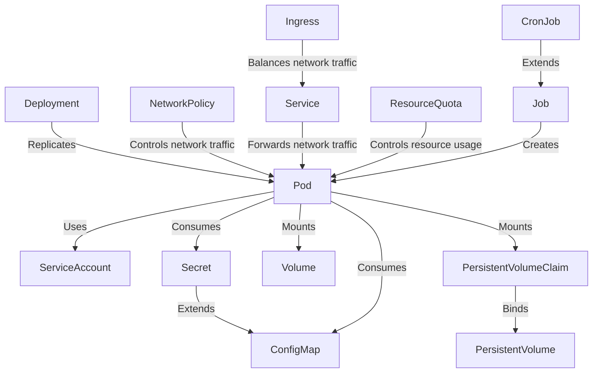

# CKAD

Notes and resources for CKAD (Certified Kubernetes Application Developer)
certification.

## Objectives

Current objectives are listed [here](https://training.linuxfoundation.org/certification/certified-kubernetes-application-developer-ckad/).

Exam is based on the latest minor version (x.**y**.z).

### Domains & Competencies

- Application Design and Build (20%)
- Application Deployment (20%)
- Application Observability and Maintenance (15%)
- Application Environment, Configuration and Security (25%)
- Services and Networking (20%)

## Kubernetes resources

Diagram illustrating Kubernetes resources that are
relevant to the CKAD, and their relationship to the pod:

## Keywords

Actively recall and explain these terms from memory.

- Container
- Image
- Dockerfile
- docker build
- docker save
- Job
- CronJob
- restartPolicy
- activeDeadlineSeconds
- Sidecar container
- Ambassador container
- Adapter container
- Init container
- Volume
- VolumeMounts
- hostPath
  - types:
    - Directory
    - DirectoryOrCreate
    - File
    - FileOrCreate
- emptyDir
- persistentVolumeClaim
- StorageClass 
- Deployment
- Replicas
- Scaling
- Rolling update
- Deployment strategy
- Blue/green deployment
- Canary deployment
- Helm
- Helm chart
- Helm repository
- API deprecation
- Deprecation policy
- apiVersion
- Deprecation window
- Deprecated API migration guide
- Liveness probe
- Readiness probe
- Startup probe
- Cluster level logs
- Kubelet logs
- CRDs
- CustomResourceDefinition
- Custom controllers
- ServiceAccounts
- ServiceAccount tokens
- Admission controller
- NameSpaceAutoProvision
- Resource requests
- Resource limits
- ResourceQuota
- ConfigMap
- Secret
- SecurityContext

## Exam tasks

List of tasks to be comfortable with before taking the exam.

Be able to accomplish these tasks using `kubectl` with `explain`, `--help`
and the Kubernetes documentation.

- Build and tag a container image using a Dockerfile.
- Save a container image to a tar archive.
- Create a Job and CronJob.
- Add a sidecar container to an existing Pod or Deployment.
- Add a Init container to a Pod or Deployment.
- Define a PersistentVolume. Bind a PersistentVolumeClaim to it.
- Configure a Pod to consume a PersistentVolumeClaim.
- Define environment variables for a container.
- Create a blue/green deployment using deployments.
- Create a canary deployment.
- Add a liveness probe to a container.
- Define a custom resource.
- Create a ServiceAccount.
- Assign a ServiceAccount to a pod.
- Enable an admission controller (e.g. NameSpaceAutoProvision).
- Configure a ResourceQuota and apply it to a namespace.
- Create a ConfigMap and pass it to a container as an environment variable.
- Create a Secret and pass it to a container as an environment variable.
- Create a ConfigMap and pass it to a container via a volumeMount.
- Create a Secret and pass it to a container via a volumeMount.
- Configure Security contexts at the pod and container level.
