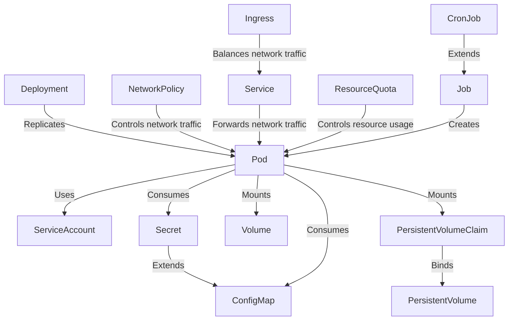

# CKAD

Notes and resources for CKAD (Certified Kubernetes Application Developer)
certification.

## Objectives

Current objectives are listed [here](https://training.linuxfoundation.org/certification/certified-kubernetes-application-developer-ckad/).

Exam is based on the latest minor version (x.**y**.z).

### Domains & Competencies

- Application Design and Build (20%)
- Application Deployment (20%)
- Application Observability and Maintenance (15%)
- Application Environment, Configuration and Security (25%)
- Services and Networking (20%)

## Kubernetes resources

Diagram illustrating Kubernetes resources that are
relevant to the CKAD, and their relationship to the pod:

## Keywords

Actively recall and explain these terms from memory.

- Container
- Image
- Dockerfile
- docker build
- docker save
- Job
- CronJob
- restartPolicy
- activeDeadlineSeconds

